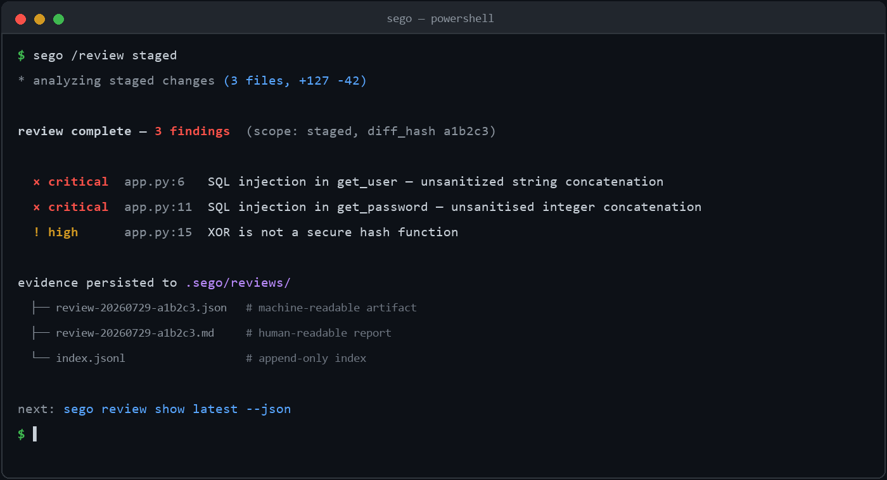
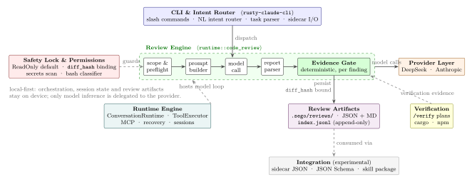

<div align="center">

**English** | [简体中文](README.zh-CN.md)

</div>

<h1 align="center">Sego </h1>

<p align="center">
  <strong>The engineering trust layer for verifying AI claims</strong><br>
  Evidence-backed review and verification of AI-generated changes —<br>
  preserving findings, coverage, and unverified items.
</p>

<p align="center">
  <a href="#quick-start"></a>
  <a href="LICENSE"></a>
  
  
</p>

---

<p align="center">
  
</p>

**Contents**: [What problem](#what-problem-does-sego-solve) · [Quick start](#quick-start) · [Review pipeline](#the-review-pipeline) · [Boundaries](#capability-boundaries) · [Architecture](#architecture) · [Integration](#integration-optional) · [Developing](#development--contributing)

---

<a id="what-problem-does-sego-solve"></a>
## What problem does Sego solve

Sego is not another AI coding tool, nor an IDE. It works **after** AI coding tools (Claude Code, Codex, Cursor, etc.) generate code: it runs a constrained, model-driven review plus deterministic evidence validation over an explicitly scoped change, and turns the result into re-checkable structured artifacts.

Three real pain points:

- **Conflict of interest**: AI coding tools review the code they generate themselves. An evaluation of 200+ vibe-coded applications found 91.5% contained vulnerabilities traceable to AI ([Keyhole Software 2026](https://keyholesoftware.com/vibe-coding-trends-2026/)); 63% of vibe coding users identify as non-developers — they cannot do a second pass themselves (same source).
- **"Done" ≠ done**: the model claims the task is complete, but acceptable evidence is missing and unverified items get silently swallowed.
- **Results cannot be re-checked**: findings carry no evidence binding, and "zero findings" gets treated as "pass".

Sego's answer: input is an explicitly scoped change plus acceptance expectations; output is structured findings + per-finding evidence status + re-checkable artifacts persisted to `.sego/reviews/`. **Zero findings is not an acceptance pass.**

<p align="center">
  
</p>
<p align="center"><sub><b>Figure 1</b>: Three risk chains in AI coding workflows — exactly what Sego targets.</sub></p>

<p align="center">
  
</p>
<p align="center"><sub><b>Figure 2</b>: Review pipeline overview. The Evidence Gate deterministically validates every candidate finding: those that pass become verified findings; out-of-scope / truncated / unconfirmed ones are preserved as unverified gaps — both paths are written to the artifacts, and zero findings is not a pass.</sub></p>

---

<a id="quick-start"></a>
## Quick start

📘 First time? Start with the user guide:

- [Online user guide (Chinese)](docs/Sego使用指南.md)
- [Word download (Chinese)](docs/Sego使用指南.docx?raw=1) (GitHub cannot preview `.docx` directly — download and open with Word/WPS if the page is blank)

### Windows (recommended: direct download)

Open [GitHub Releases](https://github.com/007M7/Sego-Agent/releases/latest), download `sego-windows.zip`, unzip and double-click `Sego.cmd`.

If you used **Code → Download ZIP** from GitHub, the archive does not contain `sego.exe`. In that case run `start-sego-windows.cmd` from the repository root — it downloads the latest release binary and starts Sego.

### Windows (one-line install)

```powershell
irm https://raw.githubusercontent.com/007M7/Sego-Agent/main/install.ps1 | iex
```

### macOS / Linux

```bash
curl -fsSL https://raw.githubusercontent.com/007M7/Sego-Agent/main/install.sh | bash
```

### Build from source

```bash
git clone https://github.com/007M7/Sego-Agent.git
cd Sego-Agent/rust
cargo build --release
./target/release/sego
```

### Configure models

Sego supports DeepSeek and Anthropic models. Set the corresponding environment variables:

**Windows PowerShell / CMD (take effect in a new terminal):**

```powershell
setx DEEPSEEK_API_KEY "your-key"
setx DEEPSEEK_MODEL "deepseek-v4-flash"

# or Anthropic
setx ANTHROPIC_API_KEY "your-key"
```

**macOS / Linux:**

```bash
# DeepSeek (recommended: cost-effective)
export DEEPSEEK_API_KEY="your-key"
export DEEPSEEK_MODEL="deepseek-v4-flash"

# or Anthropic
export ANTHROPIC_API_KEY="your-key"
```

### Safe by default

Sego **starts with read-only (ReadOnly) permissions**: review sessions cannot write files or execute commands. Writing, command execution, or autonomy requires an explicit `--permission-mode` (e.g. `workspace-write`, `danger-full-access`) or the `RUSTY_CLAUDE_PERMISSION_MODE` environment variable / project configuration.

### Your first review

```bash
cd your-project
git add -A
sego /review staged
```

Sego reviews your staged changes, outputs structured findings (severity / file / line / evidence / risk / suggestion), and persists the review result to `.sego/reviews/`.

---

<a id="the-review-pipeline"></a>
## The review pipeline: from diff to re-checkable evidence

A `sego review` runs through five stages internally, each with deterministic engineering behavior:

**① Review scope & preflight (`ReviewScope` + preflight)**
Three scopes: `Staged` / `Workspace` / `FullRepo` (snapshot, also for non-Git directories). Preflight detects risks such as embedded Git repositories and enforces policy rules (PEP-001..005), producing a `ReviewTarget` with the diff and file manifests.

**② Prompt construction (`build_review_prompt`)**
Assembles the ReviewTarget into a structured prompt: the source diff + the full file tree as context + explicit review instructions and an output contract, trimmed to fit the token budget.

**③ Model call & three-tier parsing**
Model output goes through a three-tier parsing strategy — **Direct JSON → Fenced JSON → Prose Extraction** — to accommodate different model output formats. If all three fail, the result is explicitly marked `parse_attempted_but_failed` and never silently shown as "0 findings".

**④ Evidence Gate**
Each finding is deterministically validated: does the cited location actually exist in the reviewed change? Findings that pass receive a stable `stable_finding_id` for cross-version tracking.

**⑤ Persistence & presentation**
Results are written to `.sego/reviews/` and rendered as a terminal summary / HTML Review Card (Green / Yellow / Red confidence), aggregated into an `AcceptanceRecord` to support acceptance decisions.

<p align="center">
  
</p>
<p align="center"><sub><b>Figure 3</b>: Artifact lifecycle. <code>diff_hash</code> binds each artifact to the reviewed code state; the four states (execution / verification outcome / disposition / user decision) are kept strictly separate; every fix must link a follow-up re-review.</sub></p>

### Anatomy of a finding

- **severity**: `critical / high / medium / low / info`
- **file / line / title**: locates the change
- **evidence**: concrete evidence from the diff or file contents
- **risk / suggestion**: why it matters, how to fix it
- **confidence**: model confidence
- **evidence_status**: the deterministic gate's validation result (see below)

### Evidence gate: `verified` does not mean "reproduced"

| evidence_status | meaning |
|---|---|
| `verified` | cited path is inside the captured scope and the line is valid — **this only means the location is valid and content was captured, not that the defect has been reproduced** |
| `unverified_file` / `unverified_line` / `unverified_dependency` | cited file / line / dependency cannot be confirmed in the captured content |
| `scope_not_captured` / `content_not_captured` / `content_truncated` | scope not captured / content not captured / content truncated |

When model output cannot be parsed, the result is explicitly marked `parse_attempted_but_failed` — never silently shown as "0 findings".

### Four states kept separate

| dimension | question | public wording |
|---|---|---|
| Execution state | did the check complete? | completed / failed / cancelled |
| Verification outcome | does evidence support the claim? | no sufficiently supported findings (there may still be unverified items) |
| Disposition state | how was the finding handled? | open → acknowledged → fixed (requires linked re-review) / ignored |
| User decision | accept or rework? | awaiting user decision — **never auto-generated from the verification outcome** |

### Review artifacts

Every review writes to `.sego/reviews/`:

- `review-<id>.json` — machine-readable review artifact
- `review-<id>.md` — human-readable report
- `index.jsonl` — append-only index for agents to locate review history

```bash
sego review show latest --json   # machine-readable summary of the latest review
```

Field contract: [`docs/REVIEW_ARTIFACT_CONTRACT.md`](docs/REVIEW_ARTIFACT_CONTRACT.md); agent workflow: [`docs/AGENT_REVIEW_HANDOFF.md`](docs/AGENT_REVIEW_HANDOFF.md).

### Example: a normal review

Example output of `/review staged` on a Python file (`app.py`) containing vulnerabilities:

```python
def get_user(name):
    query = "SELECT * FROM users WHERE name = '" + name + "'"  # SQL injection
    return db.execute(query)

def hash_password(pw):
    return pw ^ 0x12345678  # XOR is not a secure hash
```

| severity | file | line | title |
|---|---|---|---|
| critical | app.py | 2 | SQL injection via string concatenation |
| critical | app.py | 5 | XOR used as password hashing (reversible) |

### Example: zero findings is not a pass (sample data)

On a pure refactoring diff (renames and formatting only), Sego may return **0 findings**. This means "no sufficiently supported findings were found", **not** "the change is accepted" — whether the change can ship is still your decision. Coverage and unverified items are preserved in the artifact for re-inspection.

---

<a id="capability-boundaries"></a>
## Capability boundaries

> Sego review is model-driven, not exhaustive static analysis. Unverified items are preserved as explicit gaps — never silently converted into "passed".

- **Model-driven, not exhaustive static analysis**: `sego review` (including `--full`) is a model review of manifests, entry points, and a directory context snapshot. It does not guarantee finding every bug and does not replace mature static analyzers, security scanners, or formal verification.
- **Verify-before-trust**: missing evidence, truncation, and out-of-scope references are preserved as explicit gaps — never filled in by the model as observed facts; unverified items are never marked as passed.
- **Known limitations** (listed honestly):
  - code that *looks* dangerous but has mitigations (parameterized queries, allowlists, HMAC checks) used to be over-reported — an internal calibration evaluation identified this, and the review prompt now includes mitigation awareness (merged to main, shipping in the next release);
  - detection of timing / concurrency defects is limited and cannot replace targeted testing;
  - model output occasionally produces invalid JSON (explicitly marked via `parse_attempted_but_failed`, never disguised as zero findings).
- **Does not replace**: the Sego review artifact is engineering judgment evidence — not a security certification, compliance certification, deployment approval, or release approval. High-risk merges / releases still require tests, CI, human review, Release QA, and business context.

| Capability | status | version / evidence |
|---|---|---|
| `/review` structured review + evidence gate | available | v0.1.8+; [`docs/REVIEW_ARTIFACT_CONTRACT.md`](docs/REVIEW_ARTIFACT_CONTRACT.md) |
| Review card / acceptance record | available | v0.1.9 |
| Reviewer identity metadata | available (attribution only — not a signature / provenance proof) | v0.1.9 |
| Review artifact JSON Schema | available | v0.1.7+ (updated to current values in v0.1.9); [`schema/`](schema/) |
| Sidecar JSON interface + skill package | experimental (PoC) | `review` action only; no backward-compatibility guarantee |
| Mitigation awareness (false-positive reduction) | merged to main, shipping in the next release | [#76](https://github.com/007M7/Sego-Agent/pull/76) |
| CI integration / artifact signing / cross-tool artifact format | planned | see [ROADMAP](ROADMAP.md) |

Public claim boundaries: [`docs/PUBLIC_CLAIM_BOUNDARY.md`](docs/PUBLIC_CLAIM_BOUNDARY.md) · [`docs/RELEASE_QA_CAPABILITY_MATRIX.md`](docs/RELEASE_QA_CAPABILITY_MATRIX.md) · [`docs/LEGACY_SOURCE_BOUNDARY.md`](docs/LEGACY_SOURCE_BOUNDARY.md)

---

<a id="architecture"></a>
## Architecture

<p align="center">
  
</p>
<p align="center"><sub><b>Figure 4</b>: Sego core architecture (real subsystems). The CLI & Intent Router receives input; the <b>Review Engine</b> is the core pipeline — scope preflight → prompt builder → model call → report parser → <b>Evidence Gate</b>; Safety Lock & Permissions guard the whole path (ReadOnly by default); the Runtime Engine hosts the session and tool loop; Verification produces verification evidence; artifacts reach the integration layer via controlled consumption.</sub></p>

### Rust workspace: nine crates

Sego is a Rust workspace of nine crates with a strictly layered dependency flow — `rusty-claude-cli` builds the `sego` binary and acts as the orchestration entry point consuming the other functional crates; `telemetry` is a zero-dependency leaf.

| crate | responsibility | key components |
|---|---|---|
| **`rusty-claude-cli`** | `sego` binary entry: REPL, terminal rendering, command & intent routing | `parse_args` · `parse_nl_intent` |
| **`runtime`** | core engine: session state, permissions, review pipeline, recovery | `ConversationRuntime` · `EvidenceStatus` · `PermissionPolicy` |
| **`api`** | LLM HTTP clients & provider abstraction, SSE streaming, prompt cache | `Client` · `MessageRequest` · prompt cache |
| **`tools`** | built-in tool implementations (read/grep/bash etc.) and registration | `ToolExecutor` |
| **`commands`** | all slash command implementations and registry | `CommandRegistry` |
| **`plugins`** | plugins & hooks: external tools / lifecycle hooks | `PluginRegistry` · `HookRunner` |
| **`telemetry`** | lightweight logging & performance monitoring (zero-dependency leaf) | sink / tracer |
| **`compat-harness`** | parity layer against the reference implementation | `extract_commands` |
| **`mock-anthropic-service`** | offline test harness: mocks the Anthropic API with deterministic scenario responses | `MockAnthropicService` |

### Core subsystems

| subsystem | responsibility | key symbols |
|---|---|---|
| **Review Engine** | diff collection → prompt construction → model review → parsing → evidence gate → persistence | `ReviewScope` · `build_review_prompt` · `ReviewReport::from_model_output` · `stable_finding_id` |
| **Runtime Engine** | session loop (input → context assembly → model turn → tool execution → persistence) | `ConversationRuntime` · `SystemPromptBuilder` · `compact_session` |
| **Safety Lock & Permissions** | static scans (secrets / dangerous commands / hardcoded paths) and permission policy | `PermissionPolicy` · bash classifier |
| **Verification** | project-level verification plans (cargo / npm commands by project type) | `build_verification_plan` |
| **MCP integration** | consume tools from external MCP servers over Stdio / SSE / WebSocket | `McpToolRegistry` |

Session state is persisted via `persist_recovery_state` and survives crashes; context beyond the threshold is auto-compacted by `compact_session`.

`schema/` provides public JSON Schema contracts (in the GitHub repository):

- `review-artifact.schema.json`
- `review-index-entry.schema.json`
- `sidecar-request-response.schema.json`

- **Pure Rust, local-first**: `unsafe_code = "forbid"`, clippy pedantic.
- **diff_hash binding**: review/verify point to the same code change, preventing "review A, commit B".
- **The integration layer is experimental / PoC**: the sidecar protocol, JSON Schemas, and the skill package are early integrations without a stable ecosystem contract.

---

<a id="integration-optional"></a>
## Integration (optional)

<p align="center">
  
</p>
<p align="center"><sub><b>Figure 5</b>: Integration topology. Left: AI coding tools call Sego via sidecar / skill package; right: governance platforms consume verification results via the versioned contract — decision authority stays with the integrator.</sub></p>

Sego is fully usable standalone — every workflow in this README works without any platform. On top of that, its verification results can be consumed by external systems in two ways:

| consumer | mechanism | status |
|---|---|---|
| **AI coding tools** (Claude Code / Codex / Cursor etc.) | call Sego review via the sidecar JSON interface or skill package | experimental (PoC) |
| **Governance platforms / CI workflows** | read structured verification results and unverified items through the versioned VerificationArtifact contract, as independent verification evidence; task and release authority always stays with the integrator | in design |

> The first consumer of this contract is EgoPulse, a personal-agent governance system. Integration details and public examples will be published once the contract stabilizes.

---

<a id="development--contributing"></a>
## Development & contributing

```bash
# build
cd rust && cargo build

# test
cargo test --workspace

# format + lint
cargo fmt --all --check
cargo clippy --workspace --all-targets -- -D warnings

# run
cargo run -p rusty-claude-cli --bin sego
```

See [AGENTS.md](AGENTS.md) for the contribution flow (fork → topic branch → small focused PRs; changes touching `schema/` or the sidecar protocol are contract changes and must be flagged in the PR) and [DEVELOPMENT.md](DEVELOPMENT.md). Please update the `[Unreleased]` section of `CHANGELOG.md` in your PR.

- Issues: [GitHub Issues](https://github.com/007M7/Sego-Agent/issues)
- Security: follow [SECURITY.md](SECURITY.md) — do not file publicly
- Free / private review service: see [docs/LAUNCH.md](docs/LAUNCH.md)

## License

[MIT](LICENSE)
