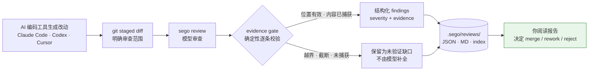
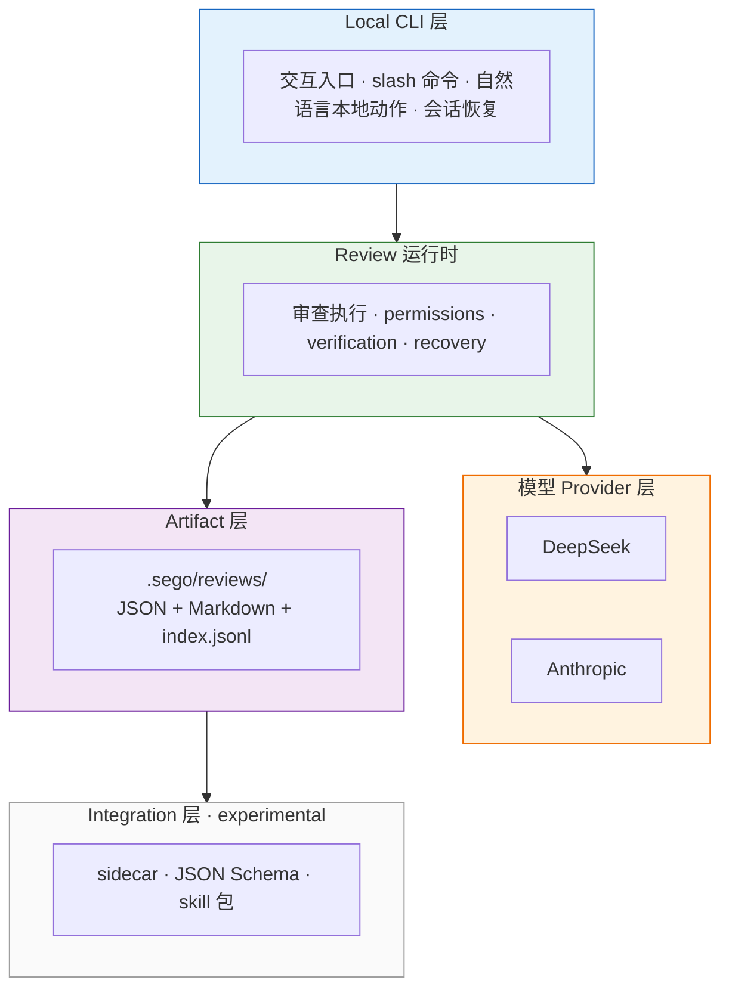

<h1>Sego </h1>

<p align="center">
  <strong>验证 AI 主张的工程信任层</strong><br>
  为 AI 生成的改动提供有证据的审查与验证——保留问题、覆盖范围和未验证项。<br>
  <sub>The engineering trust layer for verifying AI claims — traceable, evidence-backed review of AI-generated code changes.</sub>
</p>

<p align="center">
  <a href="#快速开始"></a>
  <a href="LICENSE"></a>
  
  
</p>

<p align="center">
  
</p>

---

## Sego 解决什么问题

Sego 不是另一个 AI 编码工具，也不是 IDE。它工作在 AI 编码工具（Claude Code、Codex、Cursor 等）生成代码**之后**：对明确范围的改动做模型驱动的受约束审查 + 确定性证据校验，把结果变成可复查的结构化产物。

三个真实的痛点：

- **利益冲突**：AI 编码工具既生成代码又审查自己的代码。对 200+ 个 vibe-coded 应用的评估发现 91.5% 存在可溯源到 AI 的漏洞（[Keyhole Software 2026](https://keyholesoftware.com/vibe-coding-trends-2026/)）；而 63% 的 vibe coding 用户自我认同为非专业开发者——他们没有能力自己做第二遍把关（同上）。
- **"说完成"不等于"完成"**：模型声称任务完成，但缺少可接受的证据，未验证项被静默吞掉。
- **结果不可复查**：审查发现没有证据绑定，"零发现"被当成"通过"。

Sego 的回答：输入是明确范围的改动与验收预期，输出是结构化 findings + 逐条证据状态 + 持久化到 `.sego/reviews/` 的可复查产物。**零发现不等于验收通过。**



---

## 快速开始

📘 第一次使用建议先看这份指南：

- [在线阅读版：Sego 使用指南](docs/Sego使用指南.md)
- [Word 下载版](docs/Sego使用指南.docx?raw=1)（GitHub 不能直接预览 `.docx`，如果页面空白请下载后用 Word/WPS 打开）

### Windows（推荐：直接下载）

打开 [GitHub Releases](https://github.com/007M7/Sego-Agent/releases/latest)，下载 `sego-windows.zip`，解压后双击 `Sego.cmd` 即可启动。

如果你从 GitHub 右上角 **Code → Download ZIP** 下载的是源码包，里面不会直接包含 `sego.exe`。这种情况下可以运行仓库根目录的 `start-sego-windows.cmd`，它会自动下载最新 release binary 并启动 Sego。

### Windows（一行安装）

```powershell
irm https://raw.githubusercontent.com/007M7/Sego-Agent/main/install.ps1 | iex
```

### macOS / Linux

```bash
curl -fsSL https://raw.githubusercontent.com/007M7/Sego-Agent/main/install.sh | bash
```

### 从源码构建

```bash
git clone https://github.com/007M7/Sego-Agent.git
cd Sego-Agent/rust
cargo build --release
./target/release/sego
```

### 配置模型

Sego 支持 DeepSeek 和 Anthropic 模型。设置对应的环境变量：

**Windows PowerShell / CMD（设置后重新打开终端生效）：**

```powershell
setx DEEPSEEK_API_KEY "your-key"
setx DEEPSEEK_MODEL "deepseek-v4-flash"

# 或 Anthropic
setx ANTHROPIC_API_KEY "your-key"
```

**macOS / Linux：**

```bash
# DeepSeek（推荐，性价比高）
export DEEPSEEK_API_KEY="your-key"
export DEEPSEEK_MODEL="deepseek-v4-flash"

# 或 Anthropic
export ANTHROPIC_API_KEY="your-key"
```

### 安全默认

Sego **默认以只读（ReadOnly）权限启动**：审查会话不能写入文件或执行命令。需要写入、命令执行或自主能力时，必须通过 `--permission-mode` 显式选择（如 `workspace-write`、`danger-full-access`），或用 `RUSTY_CLAUDE_PERMISSION_MODE` 环境变量 / 项目配置授权。

### 第一次 review

```bash
cd your-project
git add -A
sego /review staged
```

Sego 会审查你的暂存区改动，输出结构化的 findings（严重程度 / 文件 / 行号 / 证据 / 风险 / 修复建议），并将审查结果持久化到 `.sego/reviews/`。

---

## 结果如何阅读

> Review results are machine-readable and human-readable: every finding carries severity, evidence, and an evidence-status produced by a deterministic gate — not just model prose.

### 每条 finding 的结构

- **severity**：`critical / high / medium / low / info`
- **file / line / title**：定位到具体改动
- **evidence**：来自 diff 或文件内容的具体证据
- **risk / suggestion**：为什么重要、怎么修
- **confidence**：模型置信度
- **evidence_status**：确定性证据门的校验结果（见下）

### 证据门（evidence gate）：`verified` 不等于"缺陷已复现"

每条 finding 都经过确定性校验并标注 `evidence_status`：

| evidence_status | 含义 |
|---|---|
| `verified` | 引用路径在捕获范围内且行号有效——**仅代表位置有效、内容已捕获，不代表缺陷已被复现证实** |
| `unverified_file` / `unverified_line` / `unverified_dependency` | 引用的文件 / 行号 / 依赖无法在捕获内容中确认 |
| `scope_not_captured` / `content_not_captured` / `content_truncated` | 范围未捕获 / 内容未捕获 / 内容被截断 |

模型输出无法解析时，审查结果会明确标注 `parse_attempted_but_failed`——绝不静默显示"0 findings"。

### 四种状态分开看

| 维度 | 问的问题 | 公开措辞 |
|---|---|---|
| 执行状态 | 检查是否跑完？ | 检查完成 / 失败 / 取消 |
| 验证结论 | 证据是否支持主张？ | 未发现支持充分的问题（仍可能有未验证项）|
| 问题处理状态 | 发现如何处理？ | 已修复（需关联复验）/ 争议 / 接受风险 |
| 用户决定 | 接受还是返工？ | 等待用户决定——**不由验证结论自动生成** |

### 审查产物

每次审查写入 `.sego/reviews/`：

- `review-<id>.json` — 机器可读审查产物
- `review-<id>.md` — 人类可读报告
- `index.jsonl` — append-only 索引，供 agent 定位审查历史

```bash
sego review show latest --json   # 机器可读的最新审查摘要
```

字段契约见 [`docs/REVIEW_ARTIFACT_CONTRACT.md`](docs/REVIEW_ARTIFACT_CONTRACT.md)，agent 接入工作流见 [`docs/AGENT_REVIEW_HANDOFF.md`](docs/AGENT_REVIEW_HANDOFF.md)。

### 示例：一次正常审查

对一段含安全漏洞的 Python 代码（`app.py`）做 `/review staged` 的输出示例：

```python
def get_user(name):
    query = "SELECT * FROM users WHERE name = '" + name + "'"  # SQL 注入
    return db.execute(query)

def hash_password(pw):
    return pw ^ 0x12345678  # XOR 不是安全 hash
```

| severity | file | line | title |
|---|---|---|---|
| critical | app.py | 2 | SQL injection via string concatenation |
| critical | app.py | 5 | XOR used as password hashing (reversible) |

### 示例：零发现不等于通过（示例数据）

对一个纯重构 diff（仅重命名变量、调整格式），Sego 可能返回 **0 findings**。这表示"未发现支持充分的问题"，**不是**"该改动已通过验收"——改动是否可交付仍由你决定。审查产物中的覆盖范围与未验证项会一并保留，供你复查。

---

## 真实能力边界

> Sego review is model-driven, not exhaustive static analysis. Unverified items are preserved as explicit gaps — never silently converted into "passed".

- **模型驱动，不是穷尽式静态分析**：`sego review`（含 `--full`）是模型对 manifests、入口点和目录上下文快照的审查，不保证找出所有 bug，不替代成熟的静态分析器、安全扫描器或形式化验证。
- **verify-before-trust**：证据缺失、截断、越界都会保留为明确缺口，不会被模型补全成"已观察事实"；未验证项不会被标成通过。
- **已知局限**（诚实列出）：
  - 对"看似危险但有缓解措施"的代码（参数化查询、白名单、HMAC 校验等）曾存在误报倾向——内部校准评测已识别此问题，review prompt 已加入缓解措施识别（已合入 main，将随下一版本发布）；
  - 对时序 / 并发类缺陷的检出能力有限，不能替代针对性测试；
  - 模型输出偶发无效 JSON（会被 `parse_attempted_but_failed` 显式标注，不会伪装成零发现）。
- **不取代**：Sego 的 review artifact 是工程判断证据，不是安全认证、合规认证、部署批准或发布批准。高风险合并 / 发布仍需要测试、CI、人工审查、Release QA 与业务上下文共同决策。

| 能力 | 状态 | 版本 / 证据 |
|---|---|---|
| `/review` 结构化审查 + 证据门 | available | v0.1.8+；[`docs/REVIEW_ARTIFACT_CONTRACT.md`](docs/REVIEW_ARTIFACT_CONTRACT.md) |
| Review card / acceptance record | available | v0.1.9 |
| Reviewer identity 元数据 | available（归因用途，非签名 / 非来源证明）| v0.1.9 |
| Review artifact JSON Schema | available | v0.1.7+（v0.1.9 更新至当前值）；[`schema/`](schema/) |
| Sidecar JSON 接口 + skill 包 | experimental (PoC) | 仅 `review` action，不承诺向后兼容 |
| 缓解措施识别（降低误报）| 已合入 main，将随下一版本发布 | [#76](https://github.com/007M7/Sego-Agent/pull/76) |
| CI 集成 / artifact 签名 / 跨工具产物格式 | planned | 见 [ROADMAP](ROADMAP.md) |

公开宣称边界详见：[`docs/PUBLIC_CLAIM_BOUNDARY.md`](docs/PUBLIC_CLAIM_BOUNDARY.md) · [`docs/RELEASE_QA_CAPABILITY_MATRIX.md`](docs/RELEASE_QA_CAPABILITY_MATRIX.md) · [`docs/LEGACY_SOURCE_BOUNDARY.md`](docs/LEGACY_SOURCE_BOUNDARY.md)

---

## 集成（可选）

Sego 完全可独立使用——本 README 描述的全部工作流不依赖任何平台。在此基础上，它的验证结果可以按两种方式被外部系统消费：

| 集成对象 | 方式 | 状态 |
|---|---|---|
| **AI 编码工具**（Claude Code / Codex / Cursor 等） | sidecar JSON 接口或 skill 包调用 Sego 审查 | experimental (PoC) |
| **治理平台 / CI 工作流** | 通过版本化的 VerificationArtifact 合同读取结构化验证结果与未验证项，作为独立验证证据；任务与发布裁决始终保留在集成方 | 设计中 |

> 该验证合同的首个消费方是 EgoPulse（一个个人 Agent 治理体系）。集成细节与公开示例将随验证合同稳定后另行发布。

---

## 架构



`schema/` 目录提供公开 JSON Schema 契约（进 GitHub）：

- `review-artifact.schema.json`
- `review-index-entry.schema.json`
- `sidecar-request-response.schema.json`

- **纯 Rust，本地优先**：`unsafe_code = "forbid"`，clippy pedantic。
- **diff_hash 绑定**：review/verify 指向同一代码差异，防止"审查 A 提交 B"。
- **Integration 层目前是 experimental / PoC**：sidecar 协议、JSON Schema、skill 包属于早期集成，不承诺稳定生态契约，后续可能演进。

---

## 开发与贡献

```bash
# 构建
cd rust && cargo build

# 测试
cargo test --workspace

# 格式 + lint
cargo fmt --all --check
cargo clippy --workspace --all-targets -- -D warnings

# 运行
cargo run -p rusty-claude-cli --bin sego
```

贡献流程见 [AGENTS.md](AGENTS.md)（fork → topic branch → 小而聚焦的 PR；触及 `schema/` 或 sidecar 协议视为合同变更，需在 PR 中显式标注）与 [DEVELOPMENT.md](DEVELOPMENT.md)。PR 请更新 `CHANGELOG.md` 的 `[Unreleased]` 段。

- 问题反馈：[GitHub Issues](https://github.com/007M7/Sego-Agent/issues)
- 安全问题：按 [SECURITY.md](SECURITY.md) 处理，不要公开提交
- 免费 / 私有审查服务：见 [docs/LAUNCH.md](docs/LAUNCH.md)

## License

[MIT](LICENSE)
